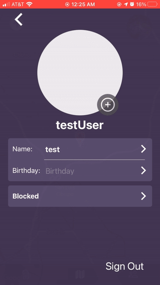

# APP DESCRIPTION

-This is a personal project of mine. It is essentially a social media app and it is in very early development.

-Currently using technologies such as Django, React Native, Redux, and a Django REST framework for development.

-In its current state, the app is unorganize has a variety of bugs. These will be fixed in the near future.

<h3>Preview:</h3>

Friends: (changing app "logo", this is simply a placeholder)

 

Profile Editing:

 

Signup:

 

